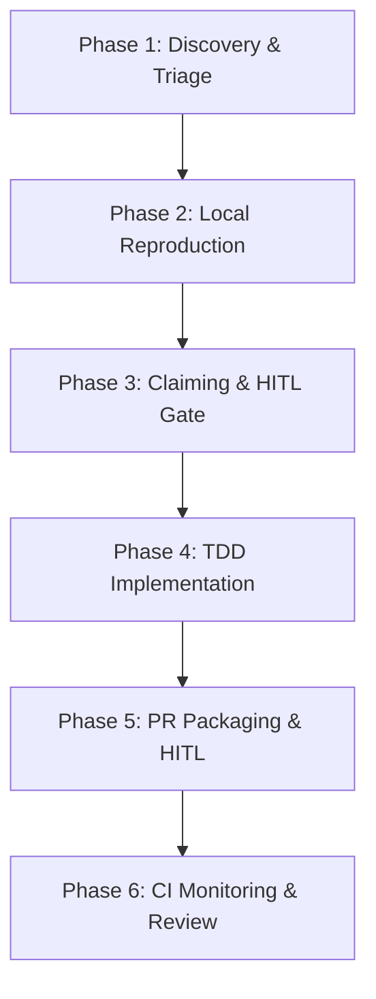

# GitHub Bounty Hunter Skill

End-to-end workflow orchestrating the complete lifecycle of paid open-source contributions across GitHub, Algora, and Polar. Governed by operational parameters in [config.json](config.json) and references in [references/](references/).

## Language Protocol
- All internal analysis, technical documentation, commit messages, and PR descriptions MUST be written in English.
- User communication, interim status updates, and session handoffs should match the user's preferred language.

## Trigger
Activates when the user requests finding, assessing, solving, or claiming paid GitHub issues, or when keywords appear: `bounty-hunter`, `github-bounty`, `paid-contribution`, `algora`, `polar`, `hunt-bounty`, `solve-bounty`.

## Workflow



### Phase 1: Discovery & Triage
**Objective**: Query bounty platforms, filter viable unassigned tasks, and eliminate stale or contested issues.

1. Ingest operational parameters from [config.json](config.json) (`search_policy`, `runtime_policy`).
2. Query candidate issues using `scripts/search_bounties.py` or the GitHub/Algora/Polar APIs per [references/discovery-platforms.md](references/discovery-platforms.md):
   - Enforce criteria: `state:open`, `no:assignee`, active bounty label (`bounty`, `algora`, `polar`), matching target language (`typescript`, `python`, `go`, `rust`).
3. Audit issue health against the Triage Matrix in [references/discovery-platforms.md](references/discovery-platforms.md):
   - Reject issues older than `max_issue_age_days` with high unresolved comment volume (> 20 comments).
   - Reject issues where another contributor was already assigned or has an active PR open.
4. Output a ranked table of 3–5 viable bounty candidates with issue number, repository, reward, and scope assessment.

### Phase 2: Local Reproduction & Environment Verification
**Objective**: Clone the repository into an isolated sandbox, build the project, and author an independent reproduction script/test confirming the issue exists.

1. Clone the target repository into an isolated workspace directory specified in [config.json](config.json) (`scratch/bounties/<repo-name>`).
2. Parse `CONTRIBUTING.md` and `README.md` to identify runtime versions, package managers, and setup instructions.
3. Install dependencies and run the baseline test suite. Verify existing tests pass before touching any code:
   - If baseline tests fail, resolve environment incompatibilities or abandon the issue to prevent false positives.
4. Create an isolated reproduction script or test case recreating the exact failure scenario described in the issue.
5. Execute the reproduction script and verify failure (Red proof). Capture CLI error output as baseline evidence.

### Phase 3: Claiming Protocol & Human-in-the-Loop (HITL) Gate
**Objective**: Formulate a professional root-cause proposal and enforce a mandatory human approval barrier before publishing any public comment.

1. Perform root cause analysis on the codebase to identify affected files and functions.
2. Draft a structured proposal comment adhering to [references/claiming-etiquette.md](references/claiming-etiquette.md):
   - State confirmed local reproduction, identified root cause, and concrete 3-step fix plan.
   - Attach platform-specific commands if applicable (`/attempt` for Algora).
3. **MANDATORY HITL GATE**: Present the drafted comment to the human operator for review and approval.
   - Halt execution. Under NO circumstances post public comments, bot commands, or claim requests without explicit human sign-off.
4. Upon operator approval, submit the comment to GitHub. Wait for maintainer assignment or proceed according to repository policy.

### Phase 4: Test-Driven Implementation (TDD)
**Objective**: Implement a surgical, minimal fix under strict Red-Green-Refactor cycles with zero collateral refactoring.

1. Create a dedicated git branch using the prefix configured in [config.json](config.json) (`fix/bounty-issue-<id>-<slug>`).
2. **Red Phase**: Formalize the reproduction script into a proper regression test located within the project's test suite. Execute test and confirm failure.
3. **Green Phase**: Apply the minimum production code necessary to resolve the failure:
   - Restrict edits strictly to affected modules (Surgical Changes). Do not refactor adjacent code or modify existing styles.
4. Run project linter and formatter (`eslint`, `prettier`, `ruff`, `cargo fmt`) to ensure strict compliance with project rules.
5. Re-run the full test suite to guarantee zero regression across existing functionality.

### Phase 5: PR Packaging & Submission
**Objective**: Package the changes into a compliant Pull Request with automated issue-closing keywords, test logs, and operator authorization.

1. Stage modified files. Verify `git diff` contains no secrets, debug logs, `.env` files, or unintended whitespace modifications.
2. Formulate commit messages following `git_policy` in [config.json](config.json) (`fix: resolve <issue_id> <description>`).
3. Generate a comprehensive PR description following [references/pr-template-guide.md](references/pr-template-guide.md):
   - Include mandatory closing keyword: `Fixes #<issue_id>` or `Closes #<issue_id>`.
   - Embed test execution output and before/after evidence.
4. **MANDATORY HITL GATE**: Present the PR title, body, and git diff summary to the operator.
5. Upon operator approval, push the branch to remote/fork and open the Pull Request via GitHub CLI (`gh pr create`) or API.

### Phase 6: CI Monitoring & Review Iteration
**Objective**: Track continuous integration checks, remediate any build/lint regressions, and address maintainer feedback constructively.

1. Monitor GitHub Actions status checks (`gh pr checks --watch`).
2. If CI fails:
   - Retrieve failure logs immediately, reproduce the specific CI failure locally, and push an atomic fix commit.
3. When maintainers submit review comments:
   - Provide prompt, professional responses.
   - Implement requested adjustments directly on the branch, re-verify tests, and notify the maintainer.
4. Once merged, verify that the bounty platform bot registers resolution and triggers payout processing.

## Token & Configuration Setup
To enable automated searches and operations, configure credentials in your environment:
- `GITHUB_TOKEN`: GitHub Personal Access Token (scopes: `repo`, `read:org`) to prevent API rate limiting.
- **Bounty Platform Accounts**: Ensure the GitHub account is linked to [console.algora.io](https://console.algora.io) and [polar.sh](https://polar.sh) with a verified Stripe Express payout account.

## Output Format
Deliver structured execution reports at each milestone:
```markdown
### 🎯 Bounty Hunter Milestone Report: [Stage Name]
- **Target Issue**: #[id] - [Title] ([owner/repo])
- **Bounty Platform**: [Algora | Polar | Native] | **Reward**: [$Amount]
- **Status**: [Triage | Repro | Claimed | Implementing | PR Open | Merged]
- **Reproduction Proof**: [Summary of test verification]
- **PR Link**: [URL] (if opened)
- **Pending Actions**: [Human confirmation | Maintainer review | CI pending]
```

## Don'ts
- **Never submit unsolicited, unverified PRs**: Blind PRs without local reproduction violate open-source etiquette and risk account suspension.
- **Never bypass the HITL Approval Gate**: The agent must NEVER post comments or submit PRs autonomously without human confirmation.
- **Never spam generic claim comments**: Messages like "Can I take this?" without technical evidence are strictly prohibited.
- **Never expand scope**: Do not fix unrelated issues, refactor working modules, or touch dependency locks unless strictly required.
- **Never commit credentials**: Never push `.env` files, API keys, or private tokens to remote repositories.

## Quality Checklist
- [ ] Issue verified as open, unassigned, and with active unawarded bounty in Phase 1?
- [ ] Local dev environment built and baseline test suite passed before making changes?
- [ ] Standalone reproduction script/test confirmed Red before applying fix?
- [ ] Mandatory HITL approval received before posting claim comment or bot command?
- [ ] Implementation adhered strictly to TDD (Red -> Green) with zero unrelated diffs?
- [ ] PR description contains required closing keyword (`Fixes #<id>`) and test evidence?
- [ ] Mandatory HITL approval received before opening public PR?
- [ ] CI build and tests verified Green after PR submission?
