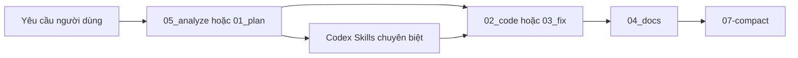

# draft_toolkits_20042026


Không gian nháp để tôi gom, nghịch, test, sáng tạo và thử nghiệm các `prompts`, `skills` và `commands` cho AI assistants, tập trung vào hai nhánh chính: `Claude commands` trong `.claude/commands` và `Codex skills` trong `.codex/skills`.

Repo này đóng vai trò như một sandbox cá nhân để thử ý tưởng mới, tinh chỉnh workflow, lưu các phiên bản nháp và kiểm nghiệm prompt trước khi tái sử dụng ở nơi khác.

## Mục lục

- [Tổng quan](#tổng-quan)
- [Vấn đề repo giải quyết](#vấn-đề-repo-giải-quyết)
- [Thành phần chính](#thành-phần-chính)
- [Tính năng nổi bật](#tính-năng-nổi-bật)
- [Cách dùng nhanh](#cách-dùng-nhanh)
- [Workflow thử nghiệm gợi ý](#workflow-thử-nghiệm-gợi-ý)
- [Cấu trúc dự án](#cấu-trúc-dự-án)
- [Ví dụ sử dụng](#ví-dụ-sử-dụng)
- [Quy ước nội dung](#quy-ước-nội-dung)
- [Giới hạn hiện tại](#giới-hạn-hiện-tại)
- [License](#license)
- [Liên hệ](#liên-hệ)

## Tổng quan

### Bài toán

Khi nghịch với AI assistants, prompt và workflow thường xuất hiện rời rạc trong chat, note hoặc thư mục tạm. Điều đó dẫn tới:

- Ý tưởng hay bị thất lạc sau vài phiên thử nghiệm.
- Khó nhớ prompt nào đang là bản nháp, prompt nào đã dùng ổn.
- Mỗi lần muốn thử biến thể mới lại phải lục lại chat cũ hoặc viết lại từ đầu.
- Khó theo dõi các thử nghiệm theo từng nhóm như `commands`, `skills` hay prompt rời.

### Cách repo này giải quyết

Repo này gom các thử nghiệm vào cấu trúc đủ gọn để dễ tìm lại và tiếp tục chỉnh sửa:

- `.claude/commands`: nơi lưu các command nháp theo từng workflow tổng quát.
- `.codex/skills`: nơi lưu các skill nháp hoặc skill chuyên biệt, có thể đi kèm `agents/` và `references/`.

Ngoài ra repo chừa sẵn:

- `draft_prompts/`: nơi soạn prompt mới, prompt biến thể, hoặc prompt đang test.
- `draft_output/`: nơi lưu output, ghi chú, bản so sánh hoặc kết quả thử nghiệm.

### Công nghệ và định dạng

- Nội dung chính: Markdown (`.md`)
- Cấu hình agent phụ: YAML (`openai.yaml`)
- Môi trường mục tiêu: Claude, Codex hoặc hệ thống tương tự có hỗ trợ command/skill theo thư mục
- Ngôn ngữ giao tiếp mặc định trong nhiều prompt: tiếng Việt

## Vấn đề repo giải quyết

- Gom prompt, skill và command nháp vào một chỗ thay vì để rải rác.
- Tạo môi trường an toàn để nghịch, thử nhiều biến thể và sửa dần theo thời gian.
- Giữ các thử nghiệm dưới dạng tài sản có version-control thay vì chỉ tồn tại trong chat history.
- Tách riêng khu vực command, skill, prompt nháp và output để dễ theo dõi vòng lặp thử nghiệm.

## Thành phần chính

### 1. Claude commands

Thư mục `.claude/commands` hiện có 7 command chính:

| File | Vai trò |
| --- | --- |
| `01_plan.md` | Phân tích yêu cầu và tạo specification/implementation plan |
| `02_code.md` | Thực thi implementation theo hướng production-quality |
| `03_fix.md` | Chẩn đoán lỗi, tìm root cause và đề xuất fix có kiểm chứng |
| `04_docs.md` | Tạo README, docs kỹ thuật, tài liệu vận hành và hướng dẫn sử dụng |
| `05_analyze.md` | Phân tích kiến trúc, luồng dữ liệu, bottleneck và thành phần quan trọng |
| `06-ask.md` | Trả lời kiến thức kỹ thuật, roadmap và guidance theo chế độ read-only |
| `07-compact.md` | Tóm tắt phiên làm việc, trạng thái file, vấn đề đã xử lý và handover |

### 2. Codex skills

Thư mục `.codex/skills` hiện có 3 skill chuyên biệt:

| Skill | Vai trò |
| --- | --- |
| `convert-model` | Chọn và hướng dẫn đường chuyển đổi model phù hợp với runtime/hardware |
| `exam-listening-verbatim` | Chép nguyên văn audio listening kiểu IELTS/TOEIC/TOEFL |
| `yolo-dataset-bootstrap` | Thiết kế pipeline bootstrap dataset YOLO bằng seed set, auto-label và QA |

Mỗi skill có thể đi kèm:

- `agents/openai.yaml`: metadata hoặc default prompt cho agent tương ứng
- `references/*.md`: tài liệu tham chiếu để tăng độ chính xác cho câu trả lời

### 3. Thư mục làm việc

| Thư mục | Mục đích |
| --- | --- |
| `draft_prompts/` | Lưu prompt đang viết, prompt nháp, prompt thử biến thể |
| `draft_output/` | Lưu output từ các lần test, note, bản so sánh hoặc kết quả đáng giữ lại |

Tại thời điểm hiện tại, hai thư mục này đang trống.

## Tính năng nổi bật

- Có chỗ riêng để thử ý tưởng prompt mà không cần trộn với repo production.
- Tách `commands`, `skills`, `draft_prompts` và `draft_output` để vòng lặp thử nghiệm rõ ràng hơn.
- Mỗi command/skill đã có cấu trúc đủ tốt để tiếp tục chỉnh sửa, copy hoặc fork sang repo khác.
- Nhiều nội dung đã quy ước ngôn ngữ và workflow nên dễ so sánh giữa các phiên bản thử nghiệm.
- Cấu trúc thư mục gọn, hợp với cách làm việc kiểu viết nháp rồi tinh chỉnh dần.

## Cách dùng nhanh

Repo này hiện là một sandbox tài liệu, không phải ứng dụng chạy trực tiếp. Không có `requirements.txt`, script cài đặt hay entrypoint thực thi ở root.

### 1. Clone repo

```bash
git clone https://github.com/ntd237/draft_toolkits_20042026.git
cd draft_toolkits_20042026
```

### 2. Dùng repo như khu vực thử nghiệm

- Mở `.claude/commands/*.md` để nghịch và chỉnh các command nháp.
- Mở `.codex/skills/<skill>/SKILL.md` để thử hoặc sửa một skill cụ thể.
- Dùng `draft_prompts/` để viết prompt mới, prompt biến thể hoặc prompt A/B.
- Dùng `draft_output/` để lưu kết quả test, note, nhận xét hoặc output muốn giữ lại.

### 3. Khi có bản ổn, mới đem đi dùng

Nếu môi trường Claude/Codex của bạn hỗ trợ nạp command hoặc skill từ thư mục, bạn có thể lấy các phần đã thử ổn trong repo này để đồng bộ:

- `.claude/commands`
- `.codex/skills`

Chi tiết cơ chế nạp phụ thuộc vào môi trường bạn đang dùng. Repo này trước hết là nơi thử nghiệm và lưu nháp, không phải bộ phân phối hoàn chỉnh.

## Workflow thử nghiệm gợi ý



Một vòng thử nghiệm điển hình có thể là:

1. Viết hoặc sửa prompt/command/skill nháp.
2. Test cách diễn đạt hoặc workflow trên một tình huống cụ thể.
3. Ghi lại output, nhận xét hoặc điểm cần sửa trong `draft_output/`.
4. Tinh chỉnh tiếp cho tới khi có một phiên bản đủ ổn.
5. Chỉ sau đó mới copy hoặc đồng bộ phần dùng được sang môi trường chính.

## Cấu trúc dự án

```text
draft_toolkits_20042026/
├── .claude/
│   └── commands/
│       ├── 01_plan.md
│       ├── 02_code.md
│       ├── 03_fix.md
│       ├── 04_docs.md
│       ├── 05_analyze.md
│       ├── 06-ask.md
│       └── 07-compact.md
├── .codex/
│   └── skills/
│       ├── convert-model/
│       │   ├── SKILL.md
│       │   ├── agents/
│       │   │   └── openai.yaml
│       │   └── references/
│       │       ├── quantization-and-shape-pitfalls.md
│       │       └── runtime-selection-matrix.md
│       ├── exam-listening-verbatim/
│       │   ├── SKILL.md
│       │   └── agents/
│       │       └── openai.yaml
│       └── yolo-dataset-bootstrap/
│           ├── SKILL.md
│           ├── agents/
│           │   └── openai.yaml
│           └── references/
│               └── thresholds-and-tooling.md
├── draft_output/
├── draft_prompts/
└── README.md
```

## Ví dụ sử dụng

### Ví dụ 1: Thử một command nháp

```text
1. Mở `05_analyze.md` hoặc `01_plan.md`.
2. Chỉnh wording, cấu trúc pha hoặc yêu cầu đầu ra.
3. Test prompt đó trên một bài toán thật.
4. Ghi nhận phần nào hiệu quả, phần nào còn dài, mơ hồ hoặc dư thừa.
```

### Ví dụ 2: Thử một skill chuyên biệt

```text
- Thử `convert-model` khi muốn kiểm tra một prompt chuyển đổi model có đủ sát hardware/runtime hay chưa.
- Thử `exam-listening-verbatim` khi muốn kiểm tra workflow transcript nguyên văn.
- Thử `yolo-dataset-bootstrap` khi muốn test một playbook annotation thực chiến.
```

### Ví dụ 3: Lưu vòng lặp thử nghiệm

```text
draft_prompts/
  - lưu prompt nháp
  - lưu prompt biến thể
  - lưu prompt so sánh A/B

draft_output/
  - lưu câu trả lời mẫu
  - lưu review notes
  - lưu kết quả test đáng giữ lại
```

## Quy ước nội dung

- Nhiều command và skill quy định trả lời bằng tiếng Việt.
- Một số workflow yêu cầu assistant phải restate yêu cầu bằng tiếng Anh trước khi trả lời tiếng Việt.
- Các file thường có front matter mô tả `description`, `type` hoặc `name`.
- Skill chuyên biệt nên đi kèm `references/` khi cần heuristic hoặc domain knowledge tái sử dụng.

## Giới hạn hiện tại

- Chưa có `LICENSE` trong repo.
- Chưa có `requirements.txt`, script setup, test suite hoặc CI pipeline vì đây không phải app runtime.
- Chưa có tích hợp tự động với một runtime Claude/Codex cụ thể.
- Nội dung trong repo có thể thay đổi nhanh vì phục vụ mục đích nghịch, test và thử nghiệm.
- `draft_prompts/` và `draft_output/` hiện vẫn đang là khu vực chờ các vòng test tiếp theo.

## License

Chưa khai báo license. Nếu repo này được chia sẻ công khai, nên thêm file `LICENSE` để làm rõ quyền sử dụng và phân phối.

## Liên hệ

- Tác giả: `ntd237`
- Email: `ntd237.work@gmail.com`
- GitHub: `https://github.com/ntd237`
